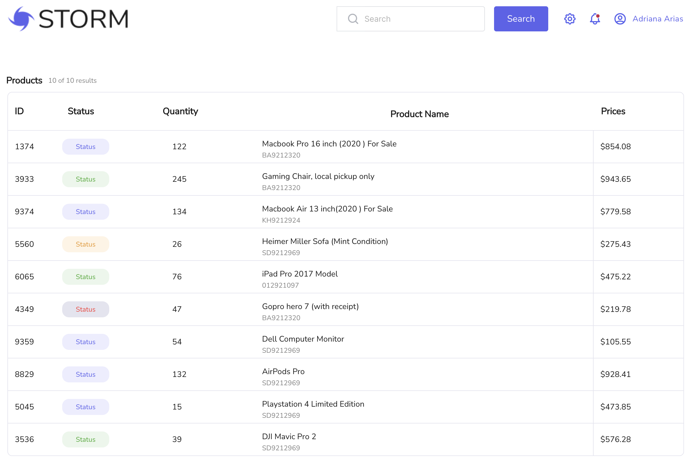
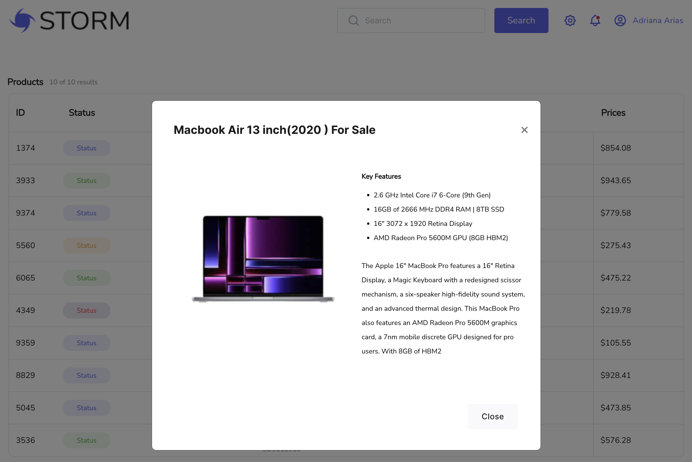
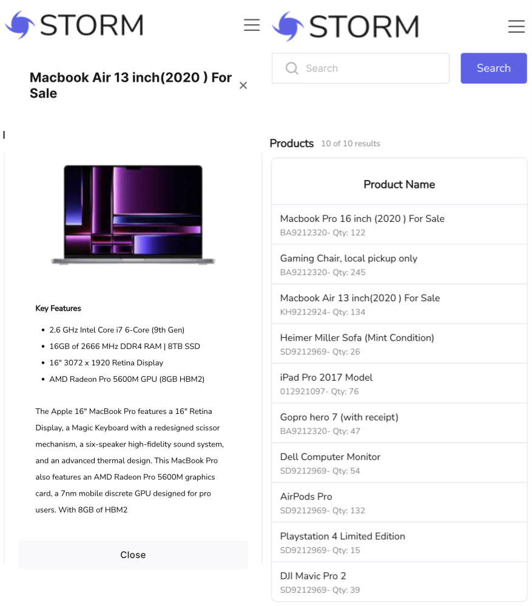
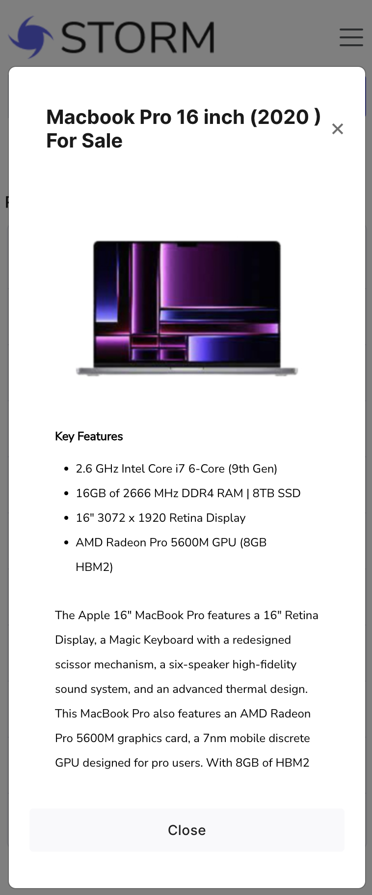

# Storm

> Web application that allows users to browse and search for products using an API.







## Features

I built a web application with helping Javascript/React/Redux and React Bootstrap library that allows users to browse and search for products using an API.
1. Displayed a list of the products on the home page: fetched product data from the API(used for this json-server plugin) and displayed ID, Status, Quantity, Product name, and Prices.
2. Implemented a search functionality.
3. Provided product details functionality.
4. Used Figma for getting design data for implementing it to View.
5. Implemented responsive view for different screen sizes and devices (desktop and mobile).

### Install Dependencies (frontend & backend)

```
npm install
```

### Run

```

# Run frontend (:3001) & backend (:3000)
npm run dev
```


